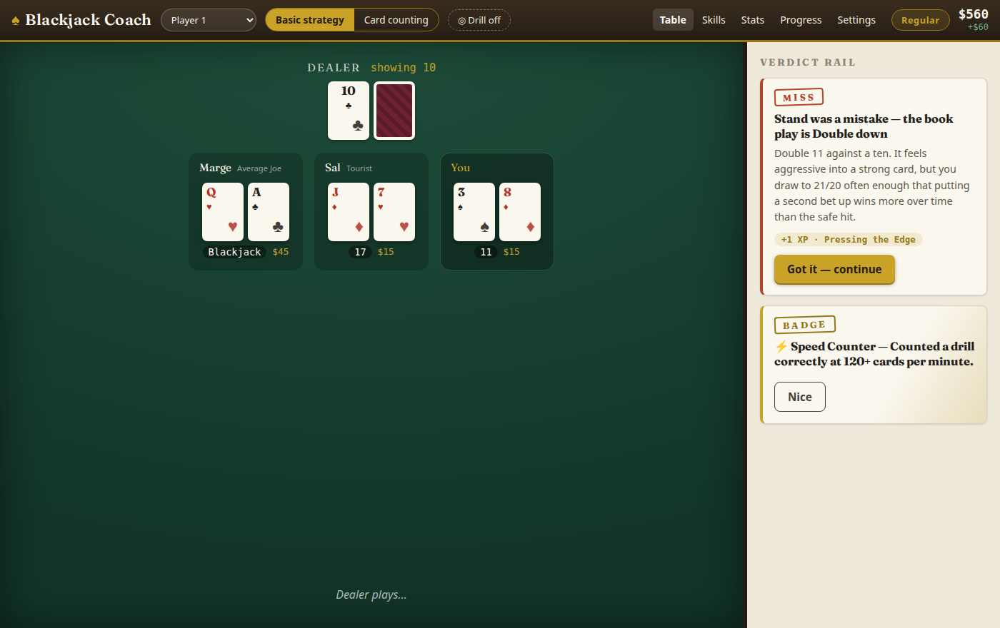
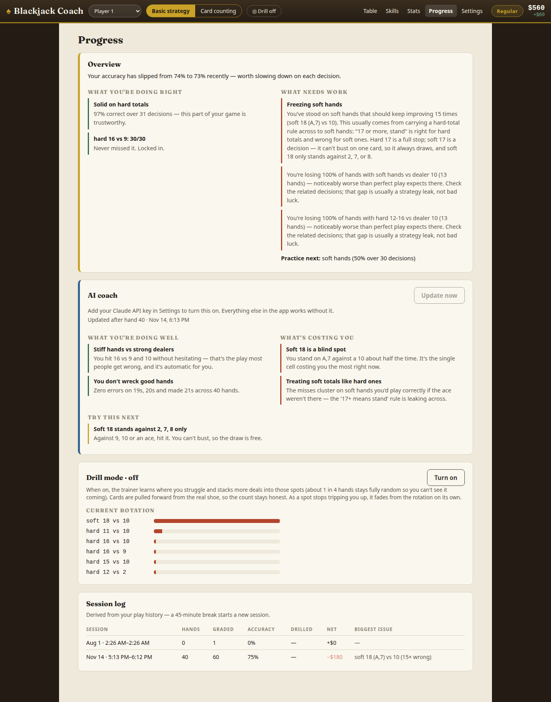
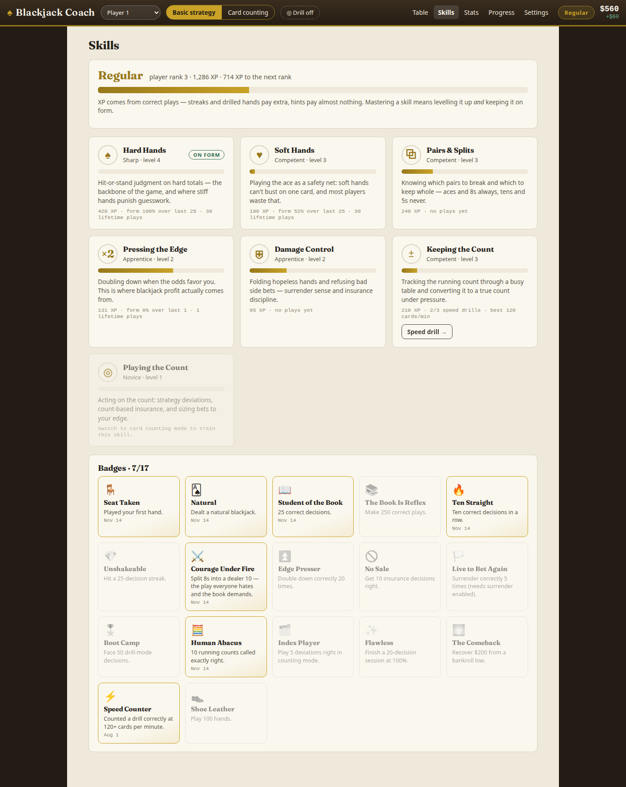

# ♠ Blackjack Coach

**A blackjack trainer that grades every decision, tells you *why*, and drills the hands you keep getting wrong.**

Plays like a real casino table — six decks, dealer hits soft 17, other players at the table, chips and a bankroll. But every move you make is graded against basic strategy in real time, with the reasoning, and the app builds a picture of how you play so it can tell you what to fix.



---

## Why another blackjack trainer?

Because most of them ship a strategy chart nobody checked.

A blackjack chart is ~360 cells of lookup table. One transposed row teaches you the wrong play thousands of times and you never find out. And the charts floating around online are usually for **S17** (dealer stands on soft 17), while most real shoe games — and this app — are **H17**, where a handful of cells flip.

This chart was transcribed **twice, independently**, from the published Wizard of Odds H17 table, and a test asserts all 360 cells of one against the other. Every deviation index has boundary tests. If a cell is ever wrong, the build fails.

That's not a hypothetical benefit. Here are four plays commonly given in "basic strategy" summaries that are **wrong for the H17 game most people actually sit down at**:

| Commonly given | Correct under H17 |
|---|---|
| Double 11 against 2–10 | **11 doubles against everything, ace included** |
| Double A,7 against 3–6 | **A,7 also doubles against a 2** |
| Soft 19 always stands | **A,8 doubles against a 6** |
| A,2–A,5 double against 5–6 | A,2/A,3 vs 5–6, but **A,4/A,5 double against 4 as well** |

If you're going to memorize something, memorize something that was checked.

---

## What it does

**Grades every decision, with the reasoning.** Not "wrong, should have hit" — an actual explanation. 36 of the trickiest spots have hand-written explanations, and everything else is composed from the underlying logic, so no cell ever answers "because the chart says so."

> *16 vs 10 is the worst spot in blackjack — every option loses money. Hitting busts about 62% of the time; standing only wins when the dealer breaks (roughly 23% with a ten up). Surrendering gives up exactly half a bet, which beats the ~54 cents per dollar you lose by hitting.*

**Wrong moves still play out.** You see what your mistake actually cost, and the grade is recorded either way.

**"What should I do?"** — a hint button that reveals the correct play and why *before* you act. Hinted hands are tracked separately so they never inflate your accuracy.

**Card counting mode.** Hi-Lo running and true count, count quizzes mid-shoe, count-based bet sizing with the reasoning, and the Illustrious 18 + Fab 4 deviations — 20 indices verified against H17-specific sources, so the "correct" answer shifts with the count exactly as it should.

**Drill mode.** The trainer learns which spots trip you up and deals more of them — weighted by how often and how recently you miss them, so a spot fades from rotation once you fix it. About one hand in four stays fully random so you can't game it. In counting mode it builds specific count scenarios by discarding cards from the real shoe (never by faking a count), including hands that land *just short* of an index, so you have to judge rather than reflex-deviate.



**Coaching that finds patterns, not just errors.** Eleven behavioral rules separate *mistakes* (over-hitting stiffs, doubling hands too weak to double, insurance leaks) from *missed opportunities* (skipped soft doubles, skipped splits, ignored count edges) — and distinguish a gap in your knowledge from a rule you half-learned and are now over-applying. It tracks strengths with the same rigor, and compares your results against what perfect play would expect, so it can tell you when you're actually leaking money versus when blackjack is just hard there.

**Optional AI coach.** With your own Claude API key, the app can send a compact digest of your stats — never raw hands — to Claude for a written read on how you play, and can keep a running assessment updated as you play. Entirely opt-in; everything above works offline.

**Skills and progression.** Seven skill tracks (hard hands, soft hands, pairs, doubling, damage control, keeping the count, playing the count) with XP, levels, a player rank, and 17 badges. Mastery needs both accumulated work *and* current form, so a skill you've let slip stops reading as mastered.



**Other players at the table.** Up to four computer opponents with distinct habits — By-the-book, Average Joe, Tourist (mimics the dealer, loves insurance), Superstitious (never "takes the dealer's bust card") — because a real table's cards affect your count, and because their bad plays don't change your odds.

**Multiple profiles.** Separate stats, skills, badges, settings, and bankroll per player, with JSON export/import.

---

## Table rules

Six decks · dealer **hits** soft 17 · double after split · blackjack pays 3:2 · resplit to four hands · no resplit aces · dealer peeks · ~75% penetration.

Late surrender is **off by default** (as at most real tables) and can be enabled — the strategy engine adapts, so 16 vs 10 becomes a surrender the moment you turn it on. Table minimum, maximum, and buy-in are all configurable.

---

## Getting started

```bash
npm install
npm run dev
```

Then open the URL Vite prints. No backend, no accounts, no build config to touch — everything is stored in your browser.

```bash
npm test        # 198 tests
npm run build   # typecheck + production build
```

---

## The AI coach (optional)

The one feature that talks to a server. It needs your own [Claude API key](https://platform.claude.com/), entered under **Settings → AI coach**, and only ever runs when you press the button or explicitly enable live coaching.

**Know what that means:** with no backend, the key is stored in your browser and sent directly from the page to Anthropic. Anything that can run script in that browser can read it, and usage bills to your account. Use a key scoped to this purpose and remove it when you're done. It is deliberately stored outside per-profile data so it can never be included in a profile export — there's a test for that.

What gets sent is derived statistics only: accuracy by category, detected tendencies, which cells you've missed, trends, and session summaries. Never raw hand history.

---

## How correctness is enforced

The interesting engineering problem here isn't the game — it's making sure the thing teaching you is right.

- **`src/engine/`** — cards, shoe, hand evaluation, H17 dealer logic, payouts, and the multi-seat round state machine. Pure functions with an injectable RNG, so entire rounds are reproducible and testable.
- **`src/strategy/`** — the chart, stored as composite codes (`Dh` = double else hit, `Rs` = surrender else stand) that resolve against what's *actually legal* for the hand in front of you. A three-card 16 can't surrender, so it grades as a hit; nine-nine with four hands already open falls through to hard 18. Turning surrender on or off needs no special-casing anywhere.
- **`src/drill/`, `src/stats/`, `src/gamify/`, `src/counting/`** — all pure logic, no React.
- **`src/components/`** — the UI, which consumes the above through hooks.

Nothing in the logic layers imports React, so all of it is testable without a DOM. The suite covers multi-ace hand evaluation, H17 dealer edge cases, split-to-four and split-aces flows, dealer peek short-circuits, cut-card and count-reset behavior, the exhaustive chart cross-check, deviation index boundaries, drill-mode shoe honesty (the shoe stays a true 312-card multiset after stacking), and coach pattern detection.

---

## Not included

No cloud sync — profiles live in one browser. No real-money anything. No claim that this makes you a winning player: basic strategy makes you a *break-even-ish* player, and counting is hard, slow work that this app can only practice, not perform for you.
